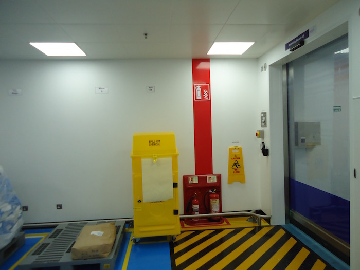
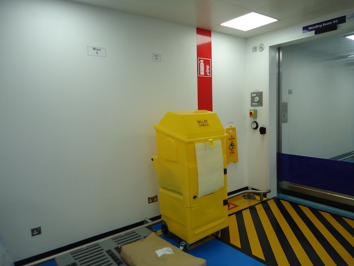
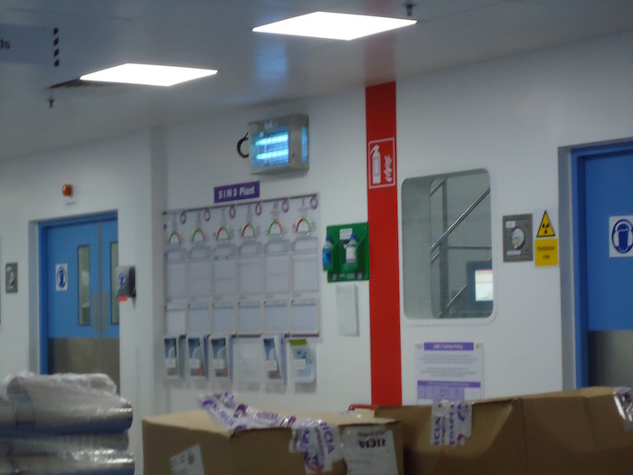
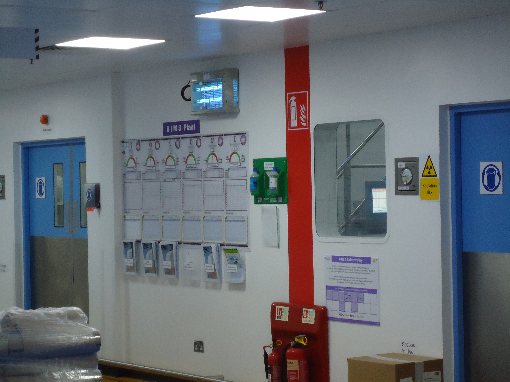
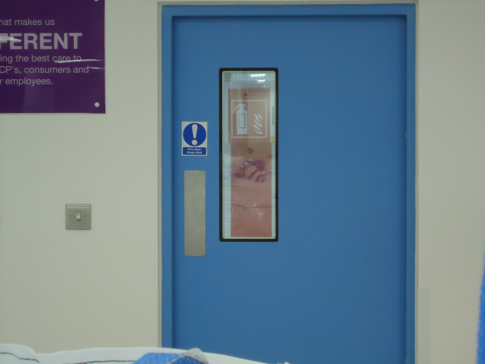

# Details

These stripes can be produced in any length and colour with almost any safety logo you require. We can produce these to cater for most requirements just contact me and I will do my utmost to fulfil your needs.

## Realworld examples

stuff gets in the way 

Things that must be on the shop floor can from some angles hide the fire points.

As seen here.

These boxes are on a pallet in a marked area,but from this angle the fire point is obscured.

## Highly visible

Without the stripe this fire point could not be seen.Even though there points on the shop floor you can't have to many!

